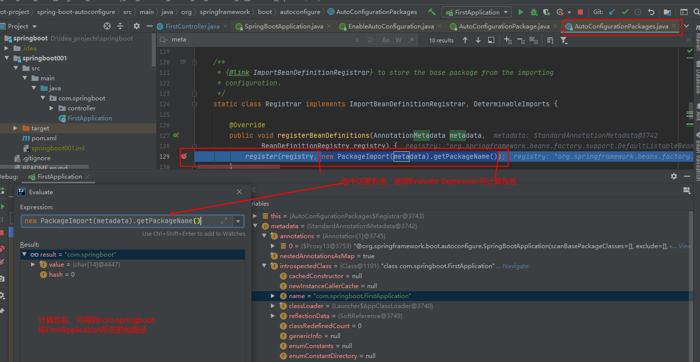
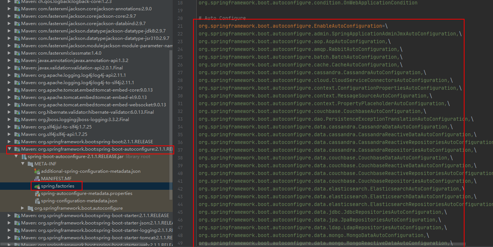
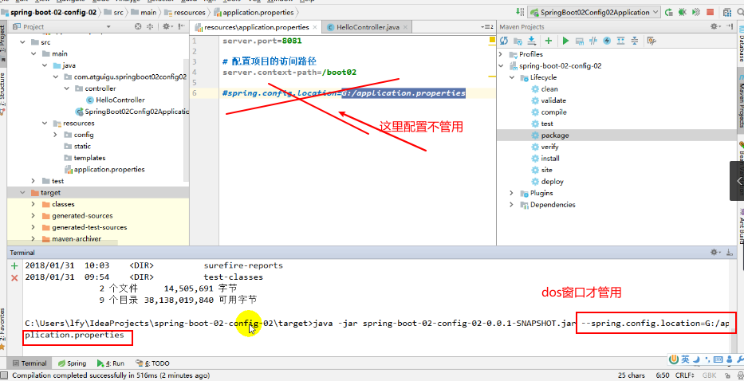
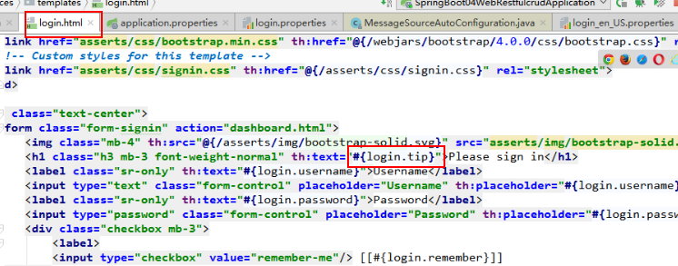
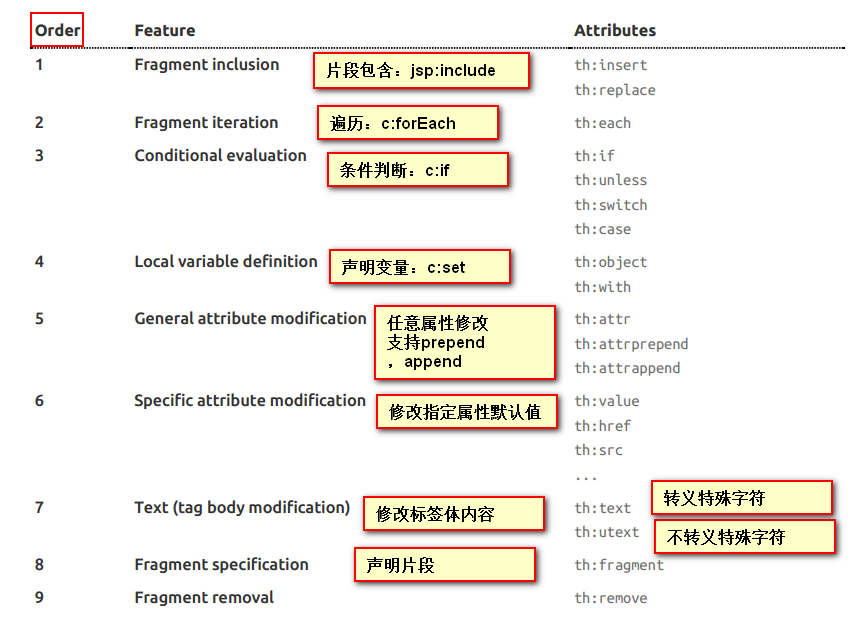
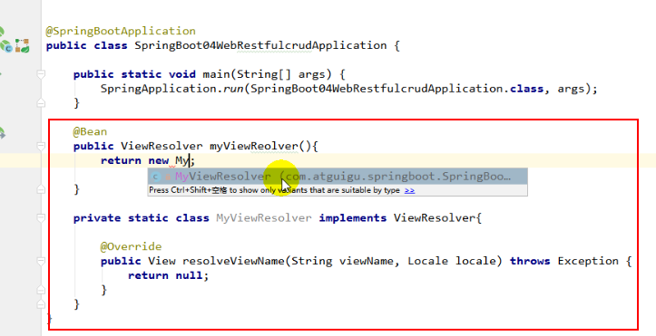
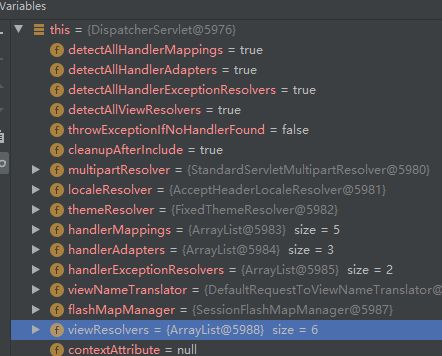
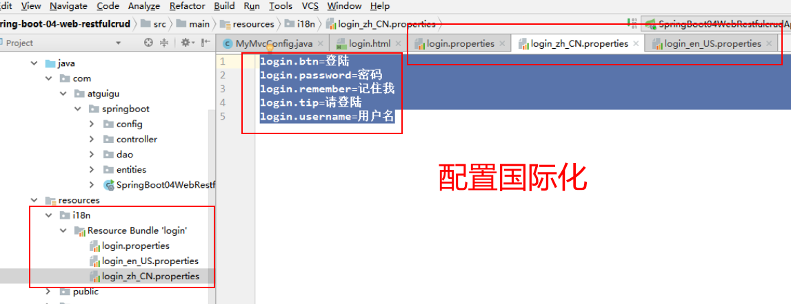
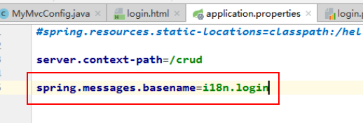

### 一，入门知识

#### 1, @SpringBootApplication注解

SpringBoot底层是以Spring框架为基础的，实际spring.xml和springmvc.xml里的配置都在@EnableAutoConfiguration里自动配置了

这个注解是SpringBoot的主配置类，它有很多元注解

```java
//@SpringBootApplication的元注解
@Target(ElementType.TYPE)
@Retention(RetentionPolicy.RUNTIME)
@Documented
@Inherited
@SpringBootConfiguration
@EnableAutoConfiguration
@ComponentScan(excludeFilters = {
		@Filter(type = FilterType.CUSTOM, classes = TypeExcludeFilter.class),
		@Filter(type = FilterType.CUSTOM, classes = AutoConfigurationExcludeFilter.class) })
public @interface SpringBootApplication {}
```

 **@SpringBootApplication的元注解的含义**

（1）@SpringBootConfiguration：SpringBoot的配置类注解，标注在一个类上，表示这个类是一个配置类

```java
@Target(ElementType.TYPE)
@Retention(RetentionPolicy.RUNTIME)
@Documented
@Configuration    //配置类上标注这个注解
public @interface SpringBootConfiguration {
}
```

（2）@EnableAutoConfiguration的下面的元注解：

```java
@Target(ElementType.TYPE)
@Retention(RetentionPolicy.RUNTIME)
@Documented
@Inherited
@AutoConfigurationPackage
@Import(AutoConfigurationImportSelector.class)
public @interface EnableAutoConfiguration {...}
```

+ @AutoConfigurationPackage:自动配置包，自动扫描com.springboot.FirstApplication.java所在目录下所有的包，

    如本例com.springboot。

    @SpringBootApplication注解所在的主应用FirstApplication.java所在的包路径下是扫描的范围，即com.springboot，如果把                   FirstApplication.java放在com包下，那么controller层的的程序就扫描不到了就会报错



+ @AutoConfigurationImportSelector：导入哪些组件的选择器

  


#### 2, @ResponseBody也可以写在类上


### 二，SpringBoot配置文件

#### 1，配置文件

​      	application.properties

​		  application.yml

  		它们名字是固定的

#### 2，YML配置文件

​		**（1）语法**：

​		Key:(空格)Value   :   表示一个键值对，注意空格必须要

​		yml以空格的缩进来控制层级关系，只要左对齐的一列数据，都属于同一层级

​        范例

```yml
server:
  port: 8081
```

​		**（2）不同类型的值的写法**

​		**字面量：普通的值（数字，布尔，字符串等）**

​		k:(空格)v : 字面值直接写，字符串默认不用加双引号或单引号，引号有别的用处

​		“ ” ： 双引号，不会转移其内的特殊字符，特殊字符还是原来的含义，例

```yaml
name: "tom \n jerry"  输出：tom
                           jerry  //换行了
name: 'tom \n jerry'  输出：tom \n jerry   //没换行，\n不会被解析为换行                            
```

​		**对象，Map的写法，也是键值对的形式**

```yaml
user: 
	name: tom
	age: 30
```

​		**数组（List,Set）的写法**

正常写法，用 -(空格)值的形式表示一个元素

```yaml
arraylist: 
	- user1
	- user2
```

行内写法：

```yaml
arraylist: {user1,user2}
```

### 三，配置文件的优先级

注意：命令行方式激活配置文件，优先级最高

虽然application.yml里指定了端口，但是一旦命令行里也指定了，按命令行的来；

命令行的方式常用于项目已发布，而要修改端口的情况。

命令行的三种方式：

第一种，在idea里配置，idea里又分为两种

（1），此中相当于命令行，激活指定的配置文件，例如本例的profiles:  dev


（2）对JVM虚拟机操作，相当于命令行


第二种，打好jar包后，在dos窗口执行解析jar包时加上  --spring.profiles.active=dev，也表示使用dev的配置文件


第三种，命令行使用"--spring.config.location=路径"



**普通方式**

 {
			if (!this.resourceProperties.isAddMappings()) {
				logger.debug("Default resource handling disabled");
				return;
			}
			Duration cachePeriod = this.resourceProperties.getCache().getPeriod();
			CacheControl cacheControl = this.resourceProperties.getCache()
					.getCachecontrol().toHttpCacheControl();
			if (!registry.hasMappingForPattern("/webjars/**")) {
				customizeResourceHandlerRegistration(registry
						.addResourceHandler("/webjars/**")
						.addResourceLocations("classpath:/META-INF/resources/webjars/")
						.setCachePeriod(getSeconds(cachePeriod))
						.setCacheControl(cacheControl));
			}
			String staticPathPattern = this.mvcProperties.getStaticPathPattern();
			if (!registry.hasMappingForPattern(staticPathPattern)) {
				customizeResourceHandlerRegistration(
						registry.addResourceHandler(staticPathPattern)
								.addResourceLocations(getResourceLocations(
										this.resourceProperties.getStaticLocations()))
								.setCachePeriod(getSeconds(cachePeriod))
								.setCacheControl(cacheControl));
			}
		}
```


### 六，Themeleaf

##### 1,导入Thymeleaf的命名空间会有语法提示


##### 2，html标签中 ，使用th: id  例，th:属性名 可给属性赋值


##### 3，th的相关语法


##### 4，*{ }，${ }，@{ }，~{ } 用法

​    *{ }${ } 用法相同，但多了一个功能，是能取出对象中的属性  

​     Thymeleaf有5种表达式: ${ },  #{ },  *{ }, @{ }, ~{ },  要讲究其含义及用法 

​      图例中是取出了user对象的属性firstName

(1)@{ } 用法

```html
<a th:href=@{/show_list} >  ：@{}后跟的url会为路径前自动加上contextPath
```

(2)${}, *{}用法


(3) #{ }可取国际化中的相关变量，参照国际化章节代码理解，



也可使用Thymeleaf的内置对象#{strings}，这里调用ieEmpty(..)方法进行判断


##### 5, th语法，有优先执行顺序，下图即为执行顺序



##### 6， Thymeleaf也有内置对象，大都跟JSP一样，同时也有一些内置工具类


##### 7，th：href的赋值可取代原有的赋值，其他th：属性名用法类似


##### 8，写在标签中间的表达式需加[[……]] 或[(……)]，它们的区别见下图

```html
<button>[[${username}]]</button> 相当于th:text一样，会转义特殊字符,
                                 即如果含有<h3>A</h3>等标签，会直接转义输出“<h3>A</h3>”
<button>[(${username})]</button> 相当于th:utext一样，不会转义特殊字符，这里则会按html语言翻译成指定标题字格式"A"
```


##### 9, 禁用Thymeleaf模板引擎的缓存，否则html页面修改内容后，还是用以前就内容的缓存

重启服务器也不管用

```propperties
spring.thymeleaf.cache = false  禁用Thymeleaf的缓存
```

(1)禁用缓存以后，需重启服务器才可重新加载html页面；

(2)或者在当前修改的html页面按Ctrl + F9，即可重新加载，不用重启服务器。


### 七，SpringMVC自动配置

#####          1，可自己定义视图解析器




在DispatcherServlet.java的doGetDispatch(..)方法里打断点可查看this里的viewResolver属性，即可看到自定义的MyViewResolver



#####       2，主要相关配置在源码WebMvcAutoConfiguration.java里


##### 3, 当SpringBoot的自动配置不能满足开发要求时，可进行手动配置，扩展SpringBoot的自动配置MVC功能

-  一般情况下SpringBoot的自动配置不能满足Web项目的开发要求，这时可自定义添加一些config类，进行配置，这些类必须继承    WebMvcConfigurerAdapter.java，并实现其内 的相关方法。这些类和自动配置共同起作用。

- 如何自定义一个类？ 需继承抽象类WebMvcConfigureAdapter.java，实现其内的抽象方法，即扩展SpringBoot的MVC模块功能，既保留原有的自动配置，也加上个人的自定义功能

- 个人自定义某项配置后，例如下面的ViewController之后，SpringBoot的同功能的这项配置自动配置就失效了。因为有个@ConditionalOnMissingBean注解在SpringBoot自带的自动配置类ViewController上，其含义是当没有自定义的ViewController时自动的才起作用。

```java
//使用一个类继承WebMvcConfigurerAdapter可以来扩展SpringMVC的功能
public class CustomizedMvcConfig  extends WebMvcConfigurerAdapter {
@Override
    public void addViewControllers(ViewControllerRegistry registry) {
        ViewControllerRegistration viewControllerRegistration = registry.addViewController("/done");
        viewControllerRegistration.setViewName("done_page");   //这里是经过视图解析器添加了后缀的，静态页面是done.html
   }
}    
```

- 上面这个个人自定义配置类能起作用的原因：

  ​     1）、WebMvcAutoConfiguration是SpringMVC的自动配置类

  ​	 2）、在做其他自动配置时会导入；@Import(**EnableWebMvcConfiguration**.class)

  ```java
  public class  WebMvcAutoConfiguration{  
      //下面的是一个静态内部类
      @Configuration
  	@Import(EnableWebMvcConfiguration.class)
  	@EnableConfigurationProperties({ WebMvcProperties.class, ResourceProperties.class })
  	@Order(0)
  	public static class WebMvcAutoConfigurationAdapter
  			implements WebMvcConfigurer, ResourceLoaderAware {
      @Configuration
  	public static class EnableWebMvcConfiguration extends DelegatingWebMvcConfiguration {
        private final WebMvcConfigurerComposite configurers = new WebMvcConfigurerComposite();
  	}
      
      //上面的@Import注解里的值EnableWebMvcConfiguration.class也是在WebMvcAutoConfiguration里的内部类
      //从容器中获取所有的WebMvcConfigurer
        @Autowired(required = false)
        public void setConfigurers(List<WebMvcConfigurer> configurers) {
            if (!CollectionUtils.isEmpty(configurers)) {
                this.configurers.addWebMvcConfigurers(configurers);
              	//一个参考实现；将所有的WebMvcConfigurer相关配置都来一起调用；  
              	@Override
               // public void addViewControllers(ViewControllerRegistry registry) {
                //    for (WebMvcConfigurer delegate : this.delegates) {
                 //       delegate.addViewControllers(registry);
                 //   }
                }
            }
  }    
  ```

  ```java
  //然后找上面继承的父类DelegatingWebMvcConfiguration.java
  @Configuration
  public class DelegatingWebMvcConfiguration extends WebMvcConfigurationSupport {
      //找到addViewControllers方法
      protected void addViewControllers(ViewControllerRegistry registry) {
  		this.configurers.addViewControllers(registry);  //在找到这个方法，这个WebMvcConfigurerComposite类里的
  	}
  }
  ```

  ```java
  class WebMvcConfigurerComposite implements WebMvcConfigurer {
  	@Override
  	public void addViewControllers(ViewControllerRegistry registry) {
  		/*从这里可知SpringBoot把所有的视图控制映射器进行了添加,包括我们自定义的配置类CustomizedConfig.java里     		 	addViewControllers(..)设置的 */
          for (WebMvcConfigurer delegate : this.delegates) {   
  			delegate.addViewControllers(registry);
  		}
  	}
  }    
  ```

  个人debug时找到了自定义的配置类CustomizedConfig.java：(右击图可选择放大)

  

  ​	3）、容器中所有的WebMvcConfigurer都会一起起作用；

  ​	4）、我们的配置类也会被调用；
  
  ​	效果：SpringMVC的自动配置和我们的扩展配置都会起作用；

##### 4，SpringBoot关于SpringMVC的的其它自动配置，这些配置也都可以个人自定义

- HttpMessageConveter :  是SpringMVC用来转换Http请求和相应的；
- MessageCodeResolver :  定义错误代码生成规则，例如： JSR303校验错误后生成的错误信息格式
- ConfigurableWebBindingIntializer :  与把请求数据转化为JavaBean有关


### 八，程序员全面接管SpringMVC

1，全面接管SpringMVC是指完全不用SpringBoot自动配置MVC，个人完全手动配置，跟之前的传统Spring框架配置MVC一样，主要用@EnableWebMvc，加上配置类@Configuration，@Bean注解的方式。

```java
@EnableWebMvc    //使用用@EnableWebMvc,全面接管SpringMvc的自动配置，即纯手工配置，SpringBoot有关MVC的自动配置都失效了
@Configuration    //自定义配置要加此注解,
public class CustomizedMvcConfig  extends WebMvcConfigurerAdapter {
```

2，@EnableWebMvc使SpringBoot组件自动失效的原因：

因为@EnableWebMvc的元注解有@Import(DelegatingWebMvcConfiguration.class)这项注解，该注解又继承了WebMvcConfigurationSupport，是其子类。

```java 
//@EnbbleWebMvc注解源码
@Retention(RetentionPolicy.RUNTIME)
@Target(ElementType.TYPE)
@Documented
@Import(DelegatingWebMvcConfiguration.class)
public @interface EnableWebMvc {
}
```

```java
//@DelegatingWebMvcConfiguration注解源码
@Configuration
public class DelegatingWebMvcConfiguration extends WebMvcConfigurationSupport {
    ...
}
```

```java
/*WebMvcAutoConfiguration.java总入口，它是SpringBoot自动配置SpringMMVC的核心类，也只主要入口。
  它的元注解@ContitionalOnMissingBean(WebMvcConfigurationSupport.class)，即当没有WebMvcConfigurationSupport时，    	 SpringBoot的自动配置才有效，而@EnableWebMvc引入了DelegatingWebMvcConfiguration.class就是一个	 				   WebMvcConfigurationSupport的子类，因此SpringBoot自动配置MVC失效。
*/
@Configuration
@ConditionalOnWebApplication(type = Type.SERVLET)
@ConditionalOnClass({ Servlet.class, DispatcherServlet.class, WebMvcConfigurer.class })
@ConditionalOnMissingBean(WebMvcConfigurationSupport.class) 
@AutoConfigureOrder(Ordered.HIGHEST_PRECEDENCE + 10)
@AutoConfigureAfter({ DispatcherServletAutoConfiguration.class,
		TaskExecutionAutoConfiguration.class, ValidationAutoConfiguration.class })
public class WebMvcAutoConfiguration {
...
}
```


### 九，国际化配置

1，手动配置国际化文件范例，国际化是指根据不同的浏览器语言显示不同的html的页面提示语言




引入以上配置文件被SpringBoot识别需在主配置文件中设置



2，其实SpringBoot已写好一个自动配置国际化的组件，只要用它的默认名，并放到默认路径即可，

默认名是message.properties，放到类路径下，但不建议用 。


### 十，yaml文件配置不同版本MySQL驱动

```yaml
# mysql驱动包, MySQL 5.x版本
driver-class-name: com.mysql.jdbc.Driver           
url: jdbc:mysql://localhost:3306/mybatis_plus?characterEncoding=utf-8&useSSL=false
#对应MySQL 8.x以上版本,8版本以上还要配置时区
driver-class-name: com.mysql.cj.jdbc.Driver 
url: jdbc:mysql://localhost:3306/mybatis_plus?serverTimezone=GMT%2B8&characterEncoding=utf-8&useSSL=false
```